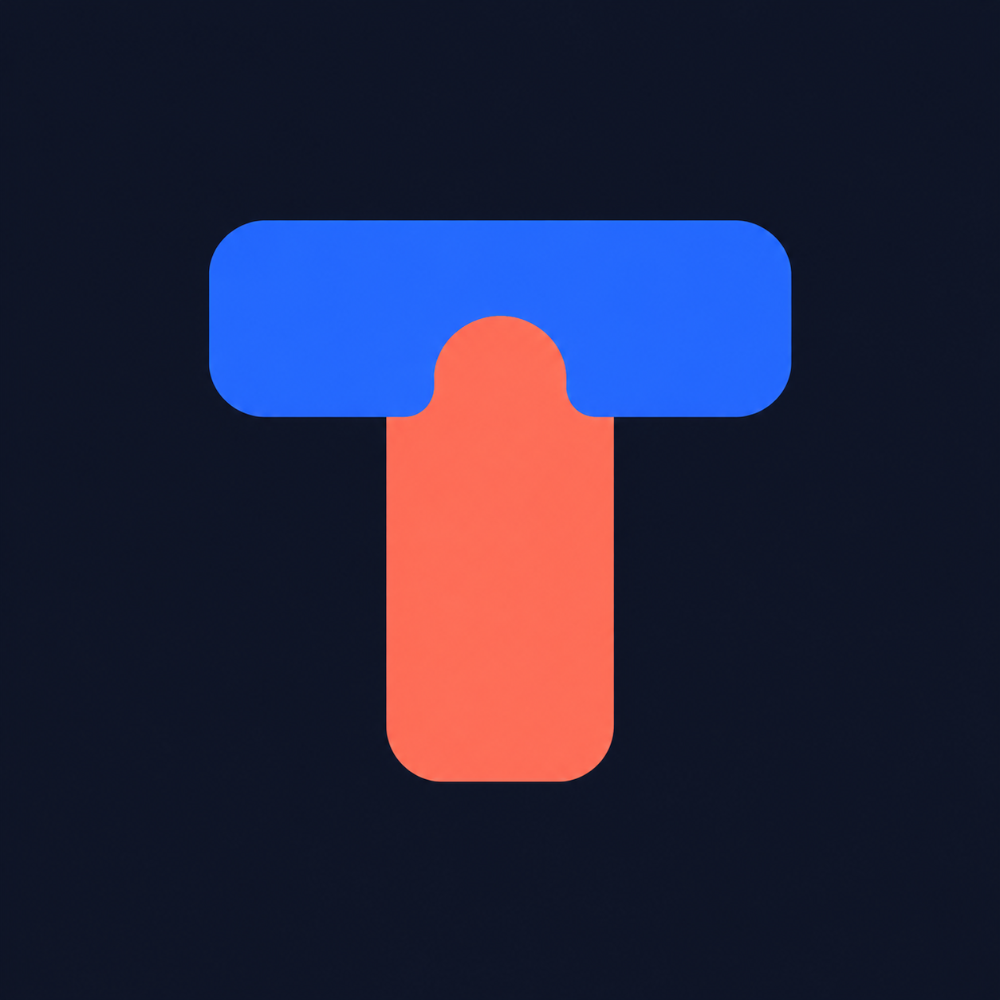

<p align="center">
  
</p>

<h1 align="center">Tag-Team</h1>

<p align="center">
  <b>Let Claude Code, Codex and Gemini work together.</b><br>
  Ask each other questions, delegate work, review each other's code, and make images with a built-in art critic.
</p>

<p align="center">
  <a href="https://github.com/AeroUp/Tag-Team/actions"></a>
  
  = 20">
  <a href="LICENSE"></a>
</p>

---

You probably pay for more than one AI coding agent. Tag-Team connects them. It's a small MCP server, plus skills, that you install into **Claude Code, Codex, Gemini CLI and Antigravity**. Once installed, any of them can call the others:

> **You (in Claude Code):** have codex review my uncommitted changes, and ask gemini whether this migration is safe
>
> **You (in Codex):** get claude's opinion on this architecture before we build it
>
> **You (anywhere):** make a logo for my app and have claude critique it until it's good

Tag-Team runs the other agents' own CLIs headless, on **your existing logins and subscriptions**. You don't need API keys, except for Gemini image generation.

## Features

| | |
|---|---|
| 🤝 **Ask & delegate** | One agent asks another for an answer, a second opinion, or a delegated task. It can keep the same conversation going across calls. |
| 🏛️ **Council** | Several agents get the same question in parallel, and you compare their answers side by side. |
| 🔍 **Cross-AI code review** | Codex, Claude and Gemini review the same diff independently. Findings are merged, and issues flagged by more than one reviewer come first. |
| 🎨 **Image studio** | Codex (built-in `image_gen`, no API key) or Gemini (Nano Banana) draws. Claude, Gemini or Codex critiques and scores the result. Then it redraws with the fixes, until the image hits your target score. |
| 📊 **Who's available?** | Shows which agents are installed and which are rate-limited, with reset times and Codex's exact usage %. |
| ⏳ **Background jobs** | Long work runs detached. Any agent can check on any job. |

> **Out of usage mid-task?** That's the companion project **[Relay](https://github.com/AeroUp/Relay)**. When your agent hits its limit, another one takes over, and the first wakes up to finish when its limit resets. Tag-Team and Relay share the same core and know about each other's rate limits.

## Install

You need **Node.js 20+** and at least two of: [Claude Code](https://claude.com/claude-code), [Codex](https://github.com/openai/codex), [Gemini CLI](https://github.com/google-gemini/gemini-cli), [Antigravity](https://antigravity.google). Log in to each one once before installing.

```bash
git clone https://github.com/AeroUp/Tag-Team.git
cd Tag-Team
node bin/tagteam.mjs install
```

Then **restart your agents**. To check the setup:

```bash
node bin/tagteam.mjs doctor
```

<details>
<summary>What <code>install</code> changes</summary>

It backs up every file it touches to `*.bak-tagteam` first.

| Agent | MCP server | Skills |
|---|---|---|
| Claude Code | `claude mcp add-json -s user tagteam …` | `~/.claude/skills/` |
| Codex | a marked block in `~/.codex/config.toml` | `~/.agents/skills/` |
| Gemini CLI | `mcpServers.tagteam` in `~/.gemini/settings.json` | `~/.gemini/skills/` |
| Antigravity | `mcpServers.tagteam` in `~/.gemini/antigravity/mcp_config.json` | `~/.gemini/antigravity/skills/` |

The config points at the folder you installed from, so keep the clone where it is. If you move it, run `install` again. To install only some agents, use `--only claude,codex`.
</details>

## Use it

Just ask your agent in plain words, or use the skills:

| Skill | For |
|---|---|
| `/tagteam` | Ask, delegate to, or compare other agents |
| `/tagteam-review` | Multi-AI code review, with findings verified before fixing |
| `/tagteam-studio` | Generate → critique → refine images |

### MCP tools

| Tool | What it does |
|---|---|
| `agents` | Who is installed or limited, Codex usage %, recent jobs |
| `ask` | Prompt one agent (`claude` / `codex` / `gemini` / `auto`). Supports `access` read/write/full, `session_id`, `images`, `fallback` |
| `council` | Send the same prompt to several agents in parallel |
| `review` | Review `uncommitted` / `staged` / `branch` / `last_commit` / `files`, with merged findings |
| `imagine` | Generate images with `codex` or `gemini` |
| `critique` | Get scores and fixes from several AI critics |
| `studio` | Run the generate → critique → regenerate loop |
| `job` | Check, wait for, or cancel background jobs |

Slow tools accept `background: true` and return a job id right away.

### CLI

```bash
tagteam ask codex "why is test_auth flaky? look at tests/auth" --cwd .
tagteam council "Postgres or SQLite for this app? see docs/requirements.md"
tagteam review --scope branch --base main --focus "error handling"
tagteam imagine "isometric pixel-art coffee shop, warm light" --engine codex --count 2
tagteam critique tagteam-images/coffee-1.png --brief "isometric pixel-art coffee shop"
tagteam studio "app icon: paper plane made of circuit traces, flat" --rounds 3 --target 8.5
tagteam jobs | tagteam job <id> --wait 300 | tagteam logs <id> -f
```

`tagteam` means `node bin/tagteam.mjs`. To get a real `tagteam` command, either run `npm link` inside the clone, or install with `npm i -g github:AeroUp/Tag-Team` and then run `tagteam install`.

### Gemini images

Gemini images need a free API key from [Google AI Studio](https://aistudio.google.com/apikey). Provide it in any of these ways:
- set `GEMINI_API_KEY`
- put `GEMINI_API_KEY=…` in `~/.gemini/.env`
- run `tagteam config set images.gemini_api_key "<key>"`

Tag-Team picks the newest Gemini image and vision models automatically.

## Configuration

`tagteam config set <key> <value>` writes to `~/.tagteam/config.json`.

| Key | Default | |
|---|---|---|
| `agents.<name>.path` | auto | Path to an agent CLI, if auto-detection misses it |
| `agents.<name>.model` | CLI default | Model to use for that agent |
| `images.engine` | `auto` | `codex`, `gemini` or `auto` |
| `images.critics` | `["claude","gemini","codex"]` | Default critics |
| `max_depth` | `2` | How deep agents may call agents (A → B → C) |
| `max_concurrent` | `6` | Max agent processes at once (shared with Relay) |
| `default_timeout_sec` | `1200` | Per agent call |

## How it works

- Each agent runs through its own CLI in headless mode:
  - **Claude:** `claude -p --output-format stream-json`
  - **Codex:** `codex exec --json`
  - **Gemini:** `gemini -p --output-format json`
- Prompts go in through stdin, and Tag-Team parses the output stream. Your agents use their own logins, models and settings.
- **Access levels.**
  - `read` (the default): Claude only gets read tools, Codex runs `-s read-only`, Gemini uses its default approval mode.
  - `write`: lets the agent edit files in `cwd`.
  - `full`: removes sandboxes and permission checks. Use it only when you mean it.
- **Recursion guard.** Every child agent inherits `AI_AGENT_DEPTH`. Once it passes `max_depth`, no more agents can be started, so agents can't ping-pong forever.
- **Shared state** lives in `~/.agent-state/`: rate limits, concurrency slots and the Codex sandbox mode. Tag-Team and Relay both use it.
- **Codex rate limits** come from Codex's own session logs: the exact used % and reset time.
- The MCP server is ~100 lines of dependency-free JSON-RPC (`src/core/mcp-server.mjs`).

## Troubleshooting

- **The tools don't show up.** Restart the agent after installing. In Claude Code, run `claude mcp list` and look for `tagteam ✔ Connected`.
- **Codex says "MCP tool call requires approval".** Run `install` again. It sets `default_tools_approval_mode = "approve"` for this server only.
- **Codex on Windows: "setup refresh had errors".** Codex's elevated sandbox sometimes can't initialise outside its desktop app. Tag-Team detects this and switches Codex to its unelevated sandbox, which is still sandboxed. The choice is stored in `~/.agent-state/codex.json`.
- **An agent isn't found.** Run `tagteam config set agents.codex.path "C:/path/to/codex.exe"`.

## Uninstall

```bash
node bin/tagteam.mjs uninstall
```

This removes the MCP entries and skills. Your data in `~/.tagteam` is kept.

## Status

`0.1.0` is an early release.
- Tested with **Claude Code** and **Codex** on Windows.
- **Gemini CLI** and **Antigravity** support follows their documented interfaces but is less battle-tested. Bug reports welcome.

Not affiliated with Anthropic, OpenAI or Google. Product names are trademarks of their owners.

## License

[MIT](LICENSE). Contributions welcome; see [CONTRIBUTING.md](CONTRIBUTING.md).
